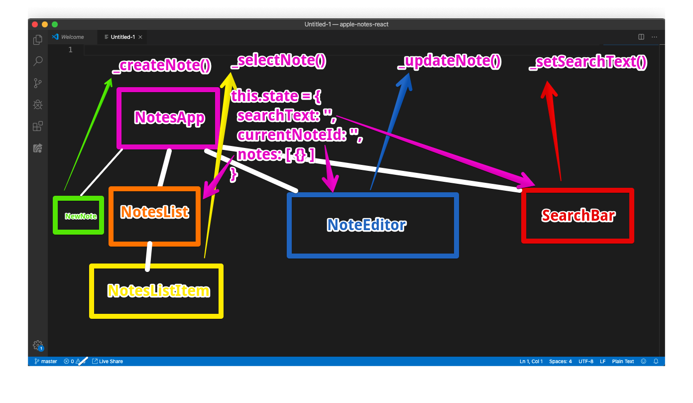

## Apple Notes App 

Exercise: Recreate as much as the Apple notes application as you can 

Features:
- A sidebar with a list of the notes 
- When you click a note, the full contents of the note can be views and edited 
- A search bar that filters the list of notes as you type

What components are in the Notes App?

A diagram of the components with state and helper functions 

The Flow of a Controlled Component 

Demo:

Demo with console.log:

