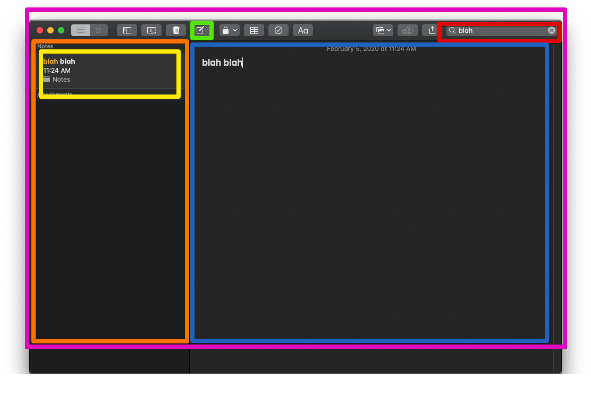

## Apple Notes App 

Exercise: Recreate as much as the Apple notes application as you can 

Features:
- A sidebar with a list of the notes 
- When you click a note, the full contents of the note can be views and edited 
- A search bar that filters the list of notes as you type

What components are in the Notes App?



A diagram of the components with state and helper functions 


The Flow of a Controlled Component 


```_updateNote``` is a helper function that updates the note as the user types in the NotesEditor text area:

```javascript
_updateNote = (changedNote) => {
        console.table(changedNote);

        const updatedNotesArray = this.state.notes.map(note => {
            if (note.id !== this.state.currentNoteId) {
                return note;
            } else {
                return changedNote;
            }
        });

        this.setState({
            notes: updatedNotesArray
        }, () => {
            console.log(`Updated note with id ${changedNote.id}`);
        });
    }
```

Update to the NotesApp class:

```javascript
<NotesEditor
    note={this._getNoteById()}
    handleChange={this._updateNote}
    />
```

And the NoteEditor function:

```javascript
export default function NoteEditor({
    note,
    handleChange
}) {

    return(
        <div>
            <input 
            value={note.title}
            // send back a copy with the updated "title"
            onChange={(event) => {
                handleChange({
                    ...note,
                    title: event.target.value
                });
            }}
            />
            <br />
            <textarea 
            value={note.copy}
            onChange={(event) => {
                handleChange({
                    ...note, 
                    copy: event.target.value
                })
                // handleChange(event.target.value)
            }}
            />
        </div>
    );
}
```

Demo:


Demo with console.log:

